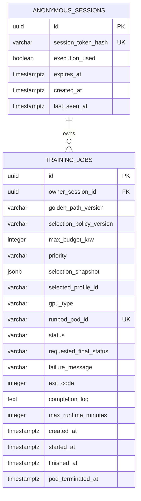

# UNWORK 학습 실행 Agent — 최소 MVP ERD

`MVP-implementation-plan.md`의 제한된 GPU 선택·실행 데모를 위한 PostgreSQL 논리 ERD다. 사용자가 보는 중심 객체는 Agent의 추천 실행 계약을 포함한 `TRAINING_JOBS`다. MVP는 artifact·사용자 API 키·실시간 실제 비용 이력을 저장하지 않는다.



## 테이블 역할

| 테이블 | 역할 |
| --- | --- |
| `ANONYMOUS_SESSIONS` | 로그인 없이 웹 브라우저를 구분한다. HttpOnly 쿠키의 원문이 아닌 해시만 저장하며, `execution_used`로 세션당 실제 실행을 1회로 제한한다. |
| `TRAINING_JOBS` | 고정 workload에 대한 제약 입력, 후보 비교 결과, Agent 추천 GPU와 실제 실행 1회를 나타낸다. Pod ID, 상태, 완료 로그, 종료 코드, 실패 이유와 Pod 종료 확인 시각을 보관한다. |

## `TRAINING_JOBS`의 선택 계약 필드

| 필드 | 의미 |
| --- | --- |
| `golden_path_version` | SD 1.5 LoRA workload, 고정 repository·명령·이미지의 버전. |
| `selection_policy_version` | `CHEAPEST`·`BALANCED`·`FASTEST` 추천 정책의 버전. |
| `max_budget_krw` | 사용자가 입력한 예상 GPU 비용 상한. 실제 청구액 제한 값은 아니다. |
| `priority` | `CHEAPEST`, `BALANCED`, `FASTEST` 중 사용자 우선순위. |
| `selection_snapshot` | Job 생성 시의 후보별 GPU·예상 시간·예상 GPU 비용·예산 적합 여부·추천 근거·추정값 안내를 담은 불변 JSON 스냅샷. API의 `executionPlan` 원본이다. |
| `selected_profile_id` | 서버 상수로 정의한 추천 Runpod 실행 프로필 ID. GPU type ID·이미지·명령 자체는 DB가 아니라 서버 설정에서 관리한다. |
| `gpu_type` | 완료 화면과 Job 조회에 표시할, Agent가 선택한 GPU 이름. |
| `requested_final_status` | `TERMINATING` 중 Pod 종료가 확인됐을 때 반영할 내부 최종 상태. `COMPLETED`, `FAILED`, `CANCELLED`, `NULL` 중 하나이며 사용자 API에는 노출하지 않는다. |

별도 `GPU_PROFILES` 테이블은 만들지 않는다. 데모 후보 2~3개는 배포 설정의 버전 관리된 서버 상수이며, `golden_path_version`과 `selection_snapshot`으로 어떤 실행 계약이 승인됐는지 재현한다.

## 상태 전이

```text
DRAFT → PROVISIONING → RUNNING → TERMINATING → COMPLETED
                                  ↘ FAILED
                                  ↘ CANCELLED
```

- `DRAFT`: Agent가 후보 비교와 추천 실행 계약을 만들고, 아직 비용이 발생하지 않은 상태
- `PROVISIONING`: 추천 프로필의 Runpod Pod 생성 요청 및 준비 중
- `RUNNING`: 학습 컨테이너가 실행 중
- `TERMINATING`: 성공·실패·취소·timeout 뒤 Pod 종료 요청 및 확인 중
- `COMPLETED`: 학습 성공 callback, 종료 코드 `0`, Pod 종료 확인이 모두 끝난 상태
- `FAILED`: Pod 생성 실패, 학습 실패, timeout 등으로 종료 처리가 끝난 상태
- `CANCELLED`: 사용자가 중단했고 종료 처리가 끝난 상태

`TERMINATING` 중에는 성공으로 표시하지 않는다. Runpod 상태 조회에서 Pod 종료를 확인한 뒤에만 최종 상태로 바꾼다.
`TERMINATING`으로 바뀔 때 `requested_final_status`를 함께 기록해, 종료 확인 뒤 올바른 최종 상태를 반영한다.

## 핵심 규칙

1. 모든 Job 조회·실행·취소 요청은 쿠키로 식별한 세션과 `owner_session_id`가 일치할 때만 허용한다. 다른 세션의 Job은 `404`로 처리한다.
2. `POST /jobs`는 고정 workload의 VRAM 조건을 만족하는 데모 GPU 프로필을 비교해 `selection_snapshot`과 `selected_profile_id`를 원자적으로 저장한다. 예산 안 후보가 없으면 Job을 만들지 않는다.
3. `POST /jobs/{jobId}/start`는 `DRAFT`의 `selected_profile_id`만 사용한다. 클라이언트가 GPU·Provider·명령을 전달하거나 기존 추천을 변경할 수 없다.
4. `POST /jobs/{jobId}/start`가 실제 Pod 생성을 시작하면 같은 세션의 `execution_used`를 `true`로 바꾼다. Job 생성·조회·실행 전 취소는 실행 횟수를 소진하지 않는다.
5. 서비스 전체에서 `PROVISIONING`, `RUNNING`, `TERMINATING` 상태의 Job은 하나만 허용한다. 이미 있으면 새 실행은 `DEMO_BUSY`로 거절한다.
6. Pod 생성 요청에는 선택 프로필에 매핑된 GPU 유형과 고정 `golden_path_version`, 최대 실행시간 10분을 사용한다. 사용자 입력으로 이를 변경할 수 없다.
7. 학습 컨테이너는 성공 또는 실패 시 종료 코드와 짧은 완료/실패 메시지를 백엔드 callback으로 보낸다. callback을 받지 못하고 10분 timeout이 지나면 Job은 `FAILED` 처리한다.
8. 성공·실패·취소·timeout은 모두 `TERMINATING`을 거쳐 `requested_final_status`를 기록하고 Pod 삭제를 요청한다. 종료 확인 전에는 최종 상태가 아니다.
9. MVP는 artifact, 사용자 Provider API 키, 실시간 가격·실제 비용, 비용 자동 중단을 저장하지 않는다. 팀 Runpod 키는 서버 환경변수 또는 Secret Vault에서만 관리하며 DB에 저장하지 않는다.
