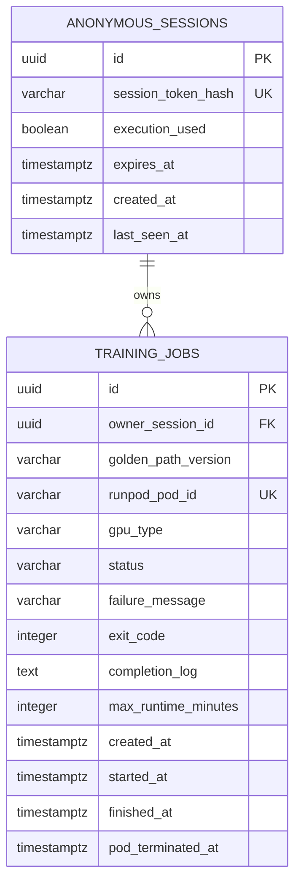

# UNWORK 학습 실행 Agent — 최소 MVP ERD

`MVP-implementation-plan.md`의 단일 Golden Path 데모를 위한 PostgreSQL 논리 ERD다. 사용자가 보는 중심 객체는 `TRAINING_JOBS`이고, MVP는 artifact·실행 계획·비용·사용자 API 키 이력을 저장하지 않는다.



## 테이블 역할

| 테이블 | 역할 |
| --- | --- |
| `ANONYMOUS_SESSIONS` | 로그인 없이 웹 브라우저를 구분한다. HttpOnly 쿠키의 원문이 아닌 해시만 저장하며, `execution_used`로 세션당 실제 실행을 1회로 제한한다. |
| `TRAINING_JOBS` | 고정 Golden Path의 실행 1회를 나타낸다. Pod ID, 상태, 완료 로그, 종료 코드, 실패 이유와 Pod 종료 확인 시각만 보관한다. |

## 상태 전이

```text
DRAFT → PROVISIONING → RUNNING → TERMINATING → COMPLETED
                                  ↘ FAILED
                                  ↘ CANCELLED
```

- `DRAFT`: 고정 실행 계획을 화면에 표시한 상태
- `PROVISIONING`: Runpod Pod 생성 요청 및 준비 중
- `RUNNING`: 학습 컨테이너가 실행 중
- `TERMINATING`: 성공·실패·취소·timeout 뒤 Pod 종료 요청 및 확인 중
- `COMPLETED`: 학습 성공 callback, 종료 코드 `0`, Pod 종료 확인이 모두 끝난 상태
- `FAILED`: Pod 생성 실패, 학습 실패, timeout 등으로 종료 처리가 끝난 상태
- `CANCELLED`: 사용자가 중단했고 종료 처리가 끝난 상태

`TERMINATING` 중에는 성공으로 표시하지 않는다. Runpod 상태 조회에서 Pod 종료를 확인한 뒤에만 최종 상태로 바꾼다.

## 핵심 규칙

1. 모든 Job 조회·실행·취소 요청은 쿠키로 식별한 세션과 `owner_session_id`가 일치할 때만 허용한다. 다른 세션의 Job은 `404`로 처리한다.
2. `POST /jobs/{jobId}/start`가 실제 Pod 생성을 시작하면 같은 세션의 `execution_used`를 `true`로 바꾼다. Job 생성·조회·실행 전 취소는 실행 횟수를 소진하지 않는다.
3. 서비스 전체에서 `PROVISIONING`, `RUNNING`, `TERMINATING` 상태의 Job은 하나만 허용한다. 이미 있으면 새 실행은 `DEMO_BUSY`로 거절한다.
4. Pod 생성 요청에는 고정 `golden_path_version`, GPU 유형, 최대 실행시간 10분을 사용한다. 사용자 입력으로 이를 변경할 수 없다.
5. 학습 컨테이너는 성공 또는 실패 시 종료 코드와 짧은 완료/실패 메시지를 백엔드 callback으로 보낸다. callback을 받지 못하고 10분 timeout이 지나면 Job은 `FAILED` 처리한다.
6. 성공·실패·취소·timeout은 모두 `TERMINATING`을 거쳐 Pod 삭제를 요청한다. 종료 확인 전에는 최종 상태가 아니다.
7. MVP는 artifact, 비용, GPU 비교, 사용자 Provider API 키를 저장하지 않는다. 팀 Runpod 키는 서버 환경변수 또는 Secret Vault에서만 관리하며 DB에 저장하지 않는다.
