# UNWORK 학습 실행 Agent — MVP ERD

`PRD-final.md`와 설계 합의를 반영한 **Runpod 단일 공급자·익명 세션 기반 웹 데모용 PostgreSQL 논리 ERD**다. 사용자에게 보이는 중심 객체는 `TRAINING_JOBS`이며, GPU VM은 실행 이력을 위한 내부 객체다.

모든 금액 컬럼은 **USD**(`numeric(12,4)`)다. 환율·실청구액 정산은 MVP 범위에 포함하지 않으며, 비용은 승인된 Runpod 시간당 가격과 경과 시간으로 계산한 추정치다.

```mermaid
erDiagram
    ANONYMOUS_SESSIONS {
        uuid id PK
        varchar session_token_hash UK
        timestamptz expires_at
        timestamptz created_at
        timestamptz last_seen_at
    }

    TRAINING_JOBS {
        uuid id PK
        uuid owner_session_id FK
        varchar repository_url
        text execution_command
        text completion_condition
        numeric max_budget_usd
        integer max_runtime_minutes
        varchar status
        timestamptz created_at
        timestamptz updated_at
        timestamptz completed_at
    }

    WORKLOAD_ANALYSES {
        uuid id PK
        uuid job_id FK
        integer sequence_no
        varchar status
        varchar resolved_commit_sha
        varchar framework
        jsonb runtime_requirements
        integer required_vram_gb
        varchar requirement_confidence
        text failure_reason
        timestamptz analyzed_at
    }

    EXECUTION_PLANS {
        uuid id PK
        uuid job_id FK
        uuid analysis_id FK
        integer version_no
        varchar status
        text infeasible_reason
        timestamptz generated_at
        timestamptz superseded_at
    }

    PLAN_OPTIONS {
        uuid id PK
        uuid plan_id FK
        varchar strategy
        boolean is_executable
        varchar unavailable_reason
        varchar runpod_gpu_type
        integer vram_gb
        varchar region
        varchar availability_status
        numeric hourly_gpu_price_usd
        integer estimated_runtime_minutes
        numeric estimated_gpu_cost_usd
        numeric estimated_storage_transfer_cost_usd
        numeric agent_fee_usd
        numeric estimated_total_cost_usd
        varchar risk_level
        text selection_rationale
        timestamptz price_observed_at
    }

    EXECUTION_CONTRACTS {
        uuid id PK
        uuid plan_id FK
        uuid selected_option_id FK
        varchar status
        varchar golden_path_version
        varchar repository_url_snapshot
        varchar commit_sha_snapshot
        text execution_command_snapshot
        text completion_condition_snapshot
        numeric max_budget_usd_snapshot
        integer max_runtime_minutes_snapshot
        numeric hourly_gpu_price_usd_snapshot
        numeric estimated_total_cost_usd_snapshot
        varchar approval_idempotency_key UK
        timestamptz price_revalidated_at
        timestamptz approved_at
        timestamptz invalidated_at
    }

    JOB_PROVIDER_CREDENTIALS {
        uuid id PK
        uuid job_id FK
        uuid contract_id FK
        varchar secret_vault_ref
        varchar status
        timestamptz attached_at
        timestamptz disposed_at
    }

    EXECUTION_ATTEMPTS {
        uuid id PK
        uuid job_id FK
        uuid contract_id FK
        uuid resumed_from_attempt_id FK
        integer attempt_no
        varchar attempt_kind
        varchar status
        varchar stop_reason
        numeric final_estimated_total_cost_usd
        timestamptz started_at
        timestamptz ended_at
    }

    COMPUTE_RESOURCES {
        uuid id PK
        uuid attempt_id FK
        varchar runpod_pod_id UK
        varchar resource_label
        varchar status
        integer termination_request_count
        timestamptz provisioned_at
        timestamptz termination_requested_at
        timestamptz termination_confirmed_at
        timestamptz last_reconciled_at
    }

    RESOURCE_CLEANUP_ATTEMPTS {
        uuid id PK
        uuid resource_id FK
        integer sequence_no
        varchar action
        varchar status
        text provider_response_summary
        timestamptz requested_at
        timestamptz resolved_at
    }

    COST_SNAPSHOTS {
        uuid id PK
        uuid job_id FK
        uuid attempt_id FK
        uuid resource_id FK
        integer elapsed_seconds
        numeric hourly_gpu_price_usd
        numeric estimated_gpu_cost_usd
        numeric estimated_total_cost_usd
        timestamptz observed_at
    }

    ARTIFACTS {
        uuid id PK
        uuid job_id FK
        uuid attempt_id FK
        varchar artifact_type
        varchar storage_object_key
        varchar checksum
        bigint byte_size
        varchar status
        timestamptz uploaded_at
        timestamptz download_expires_at
        timestamptz deleted_at
    }

    JOB_EVENTS {
        uuid id PK
        uuid job_id FK
        uuid attempt_id FK
        uuid resource_id FK
        varchar event_type
        varchar visibility
        varchar actor_type
        text message
        jsonb metadata
        timestamptz occurred_at
    }

    ANONYMOUS_SESSIONS ||--o{ TRAINING_JOBS : owns
    TRAINING_JOBS ||--o{ WORKLOAD_ANALYSES : has
    TRAINING_JOBS ||--o{ EXECUTION_PLANS : has
    WORKLOAD_ANALYSES ||--o{ EXECUTION_PLANS : informs
    EXECUTION_PLANS ||--o{ PLAN_OPTIONS : presents
    EXECUTION_PLANS ||--o| EXECUTION_CONTRACTS : becomes
    PLAN_OPTIONS o|--o| EXECUTION_CONTRACTS : selects

    TRAINING_JOBS ||--o{ JOB_PROVIDER_CREDENTIALS : temporarily_uses
    EXECUTION_CONTRACTS ||--o| JOB_PROVIDER_CREDENTIALS : authorizes
    TRAINING_JOBS ||--o{ EXECUTION_ATTEMPTS : contains
    EXECUTION_CONTRACTS ||--o{ EXECUTION_ATTEMPTS : authorizes
    EXECUTION_ATTEMPTS o|--o{ EXECUTION_ATTEMPTS : resumes
    EXECUTION_ATTEMPTS ||--o| COMPUTE_RESOURCES : provisions
    COMPUTE_RESOURCES ||--o{ RESOURCE_CLEANUP_ATTEMPTS : cleans_up

    TRAINING_JOBS ||--o{ COST_SNAPSHOTS : tracks
    EXECUTION_ATTEMPTS ||--o{ COST_SNAPSHOTS : measures
    COMPUTE_RESOURCES o|--o{ COST_SNAPSHOTS : incurs
    TRAINING_JOBS ||--o{ ARTIFACTS : delivers
    EXECUTION_ATTEMPTS ||--o{ ARTIFACTS : produces
    TRAINING_JOBS ||--o{ JOB_EVENTS : records
    EXECUTION_ATTEMPTS o|--o{ JOB_EVENTS : emits
    COMPUTE_RESOURCES o|--o{ JOB_EVENTS : emits
```



## 테이블 역할

| 테이블 | 역할 |
| --- | --- |
| `ANONYMOUS_SESSIONS` | 로그인 없이 웹 브라우저를 구분하는 소유권 경계다. HttpOnly 쿠키의 원문은 저장하지 않고 해시만 보관한다. |
| `TRAINING_JOBS` | Repository URL, 실행 명령, 예산, 완료 조건을 가진 사용자의 작업 단위. `owner_session_id`를 통해 익명 세션에만 노출한다. |
| `WORKLOAD_ANALYSES` | 실행 가능 여부, VRAM 요구량, 분석 당시 해석한 commit SHA를 순서대로 보존한다. |
| `EXECUTION_PLANS` / `PLAN_OPTIONS` | 분석 결과로 만든 Plan 버전과 최대 세 개의 Runpod 후보(저렴함·빠름·균형형) 스냅샷이다. |
| `EXECUTION_CONTRACTS` | 사용자가 승인한 불변 실행 계약이다. 코드·명령·예산·가격·Golden Path 버전을 고정한다. |
| `JOB_PROVIDER_CREDENTIALS` | Runpod 키 원문이 아닌 Secret Vault 참조와 폐기 이력만 보관한다. |
| `EXECUTION_ATTEMPTS` | 승인 후의 실제 실행 또는 인프라 중단 뒤 1회 재개 이력이다. OOM 재계획은 새 Contract의 Attempt가 된다. |
| `COMPUTE_RESOURCES` / `RESOURCE_CLEANUP_ATTEMPTS` | Runpod Pod와 종료 요청·재시도·확인 이력이다. |
| `COST_SNAPSHOTS` | Running 중 1분 간격 및 주요 상태 변화 때 기록하는 누적 추정 비용이다. |
| `ARTIFACTS` | output, log, checkpoint의 보관·만료·삭제 상태다. |
| `JOB_EVENTS` | 사용자 타임라인과 내부 운영 이벤트를 남긴다. 비밀값·VM ID·공급자 오류 원문은 일반 사용자 이벤트에 넣지 않는다. |

## 실행 흐름과 상태 전이

```text
DRAFT → ANALYZING → AWAITING_APPROVAL → PROVISIONING → PREPARING → RUNNING
      → FINALIZING → COMPLETED | FAILED | CANCELLED
                     ↘ CLEANUP_ATTENTION_REQUIRED
```

- `TRAINING_JOBS.status`: `DRAFT`, `ANALYZING`, `AWAITING_APPROVAL`, `PROVISIONING`, `PREPARING`, `RUNNING`, `FINALIZING`, `CLEANUP_ATTENTION_REQUIRED`, `COMPLETED`, `FAILED`, `CANCELLED`.
- `EXECUTION_PLANS.status`: `AWAITING_APPROVAL`, `APPROVED`, `SUPERSEDED`, `INFEASIBLE`. 입력 수정 또는 승인 직전 가격·가용성 변경 시 기존 Plan은 `SUPERSEDED`가 된다.
- `EXECUTION_CONTRACTS.status`: `PENDING_REVALIDATION`, `APPROVED`, `REJECTED`, `INVALIDATED`. 재검증에 실패하면 Contract는 승인되지 않고 새 Plan을 만든다.
- `EXECUTION_ATTEMPTS.status`: `PROVISIONING`, `PREPARING`, `RUNNING`, `STOPPING`, `FINALIZING`, `SUCCEEDED`, `FAILED`, `CANCELLED`.
- `COMPUTE_RESOURCES.status`: `PROVISIONING`, `RUNNING`, `TERMINATION_REQUESTED`, `TERMINATION_CONFIRMING`, `TERMINATED`, `RECONCILIATION_REQUIRED`, `LEAK_SUSPECTED`.

`COMPLETED`는 다음이 모두 참일 때만 허용한다.

1. Training process가 성공적으로 종료됐다.
2. 해당 Attempt의 `OUTPUT`, `LOG` artifact가 모두 `AVAILABLE`이다.
3. 최종 `COST_SNAPSHOTS`가 기록됐다.
4. 연결된 모든 `COMPUTE_RESOURCES`가 `TERMINATED`다.

Training 오류·예산 90% 도달·최대 실행시간·사용자 취소도 동일하게 `FINALIZING`을 거쳐 Resource 종료를 시도한다. 종료가 확인되지 않으면 Job을 종료 상태로 오인시키지 않고 `CLEANUP_ATTENTION_REQUIRED`에 두며, 이때에만 Runpod Pod ID와 직접 종료 방법을 제공한다.

## 핵심 무결성 및 보안 규칙

1. 모든 Job 조회·수정·승인·취소·artifact 요청은 쿠키로 식별한 `ANONYMOUS_SESSIONS.id`와 `TRAINING_JOBS.owner_session_id`가 일치할 때만 허용한다. 불일치는 리소스 존재를 노출하지 않도록 `404`를 반환한다.
2. `WORKLOAD_ANALYSES (job_id, sequence_no)`, `EXECUTION_PLANS (job_id, version_no)`, `EXECUTION_ATTEMPTS (job_id, attempt_no)`, `RESOURCE_CLEANUP_ATTEMPTS (resource_id, sequence_no)`는 각각 유니크하다.
3. `EXECUTION_CONTRACTS.plan_id`, `COMPUTE_RESOURCES.attempt_id`는 각각 유니크하다. `JOB_PROVIDER_CREDENTIALS.contract_id`는 키 연결 시에는 `NULL`을 허용하고, 승인 뒤 생성된 Contract에 연결한 뒤 유니크하게 관리한다. `selected_option_id`가 같은 Plan의 Option인지 복합 FK 또는 트리거로 검증한다.
4. Plan당 `PLAN_OPTIONS.strategy`는 유니크하며 `CHEAPEST`, `FASTEST`, `BALANCED` 중 하나다. 실행 가능한 후보는 서로 다른 `runpod_gpu_type`이어야 한다. 후보가 부족하면 가능한 후보와 제외 이유만 보인다.
5. 승인 API는 `approval_idempotency_key`를 사용한다. Contract 승인과 첫 Attempt 생성은 한 트랜잭션으로 처리하고, Job당 `PROVISIONING`부터 `FINALIZING`까지의 활성 Attempt는 하나만 허용하는 부분 유니크 인덱스를 둔다.
6. 승인 직전 선택 Option의 Runpod GPU 종류·가용성·시간당 가격을 재조회한다. 하나라도 달라지면 승인하지 않고 기존 Plan을 `SUPERSEDED`로 전환한 뒤 새 Plan을 생성한다.
7. 입력 수정은 승인 전까지만 허용한다. 수정 시 기존 Plan은 `SUPERSEDED`, Job은 `ANALYZING`이 되며 새 Analysis·Plan을 만든다. Contract 승인 뒤의 입력 변경은 새 Job으로만 가능하다.
8. Contract에는 `repository_url_snapshot`, 분석 시 해석한 `commit_sha_snapshot`, 명령·완료 조건·예산·실행시간·가격·Golden Path 버전을 복사한다. 실행 및 인프라 중단 후 재개는 이 스냅샷의 commit SHA만 checkout한다.
9. 비용은 `elapsed_seconds / 3600 × hourly_gpu_price_usd_snapshot`으로 계산한다. 1분마다 비용 Snapshot을 남기고, 80%는 경고 이벤트를 한 번 기록하며 90% 이상 또는 최대 실행시간 도달 시 중단·checkpoint 보관 시도·VM 종료를 시작한다.
10. `JOB_PROVIDER_CREDENTIALS.secret_vault_ref`만 DB에 저장한다. Runpod 키 원문, VM ID, Provider API 오류 원문은 일반 `JOB_EVENTS`에 기록하지 않는다. 완료·실패·취소 시 Vault 원문을 폐기하고 `disposed_at`을 남긴다.
11. 상태를 바꾸는 API는 HttpOnly 세션 쿠키와 `X-CSRF-Token`을 함께 검증한다. CSRF 토큰은 세션별로 발급하며, 쿠키 원문·토큰 원문은 DB에 저장하지 않는다.
12. Artifact 원본은 `download_expires_at`을 업로드 후 24시간으로 설정하고 만료 뒤 삭제한다. 다운로드 URL은 DB에 저장하지 않고 요청 시 짧은 수명의 서명 URL로 발급한다. Job 메타데이터는 MVP 데모 기간 동안 유지한다.
